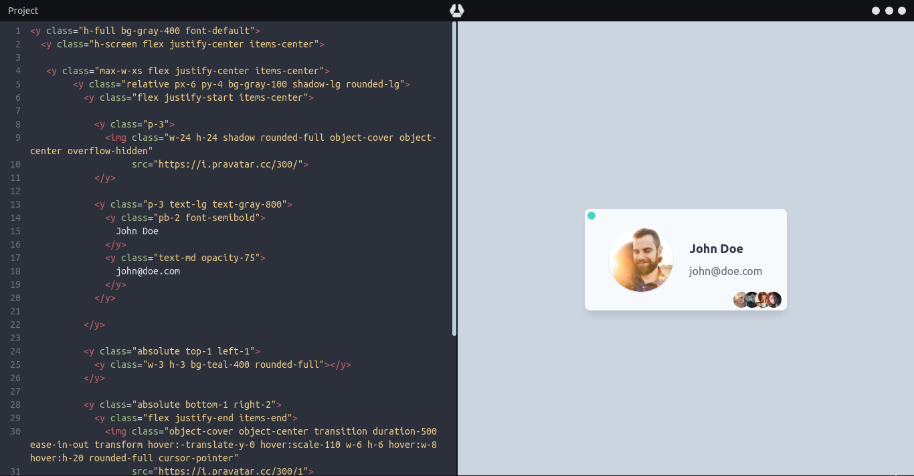

# yogurt-playground

  
  
  
  
  
  
  
  
  
  
  
  

A frontend development tool for testing and prototyping with [Yogurt](https://github.com/loouislow81/yogurt-foundation/tree/2.x.x) toolkit.

**(Work in progress!)**

  

  

---

## _download

available binaries for Linux, Windows is [here](https://github.com/loouislow81/yogurt-playground/releases/tag/v0.1.2-beta).

---

[MIT](https://github.com/loouislow81/yogurt-playground/blob/master/LICENSE)
