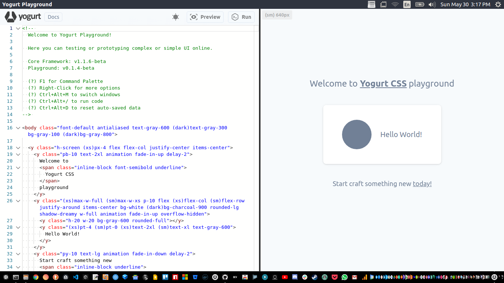

<p align="left">
  
</p>

# playground

<p align="left">
  
  
  
  
  
  
  
  
  
  
  
  
</p>

A developer playground for testing and prototyping with Yogurt CSS and Yogurt FX.

> Work in progress

<p align="center">
  
</p>

---

### _run

```bash
# using yarn
$ yarn start

# using npm
$ npm run start
```

### _build

```bash
# build linux app
$ yarn build:linux

# build mac app
$ yarn build:mac

# build windows app
$ yarn build:windows
```

---

[MIT](https://github.com/yogurt-foundation/playground/blob/master/LICENSE)
