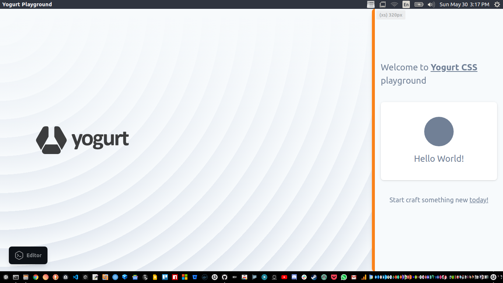

<p align="left">
  
</p>

# playground

<p align="left">
  <a href="https://discord.gg/A62YjNR"
     target="_blank">
    
  </a>
  
  
  
  
  
  
  
  
  
  
  
  
</p>

A developer playground for testing and prototyping with Yogurt CSS framework and other micro libraries.

<p align="center">
  
</p>

---

### _run

```bash
# YARN
$ yarn start

# NPM
$ npm run start
```

### _build

```bash
# build linux app
$ yarn build:linux

# build mac app
$ yarn build:mac

# build windows app
$ yarn build:windows
```

### _binary

[Download the precompiled desktop binary](https://github.com/yogurt-foundation/playground/releases/tag/0.1.2-beta).

---

[MIT](https://github.com/yogurt-foundation/playground/blob/master/LICENSE)
